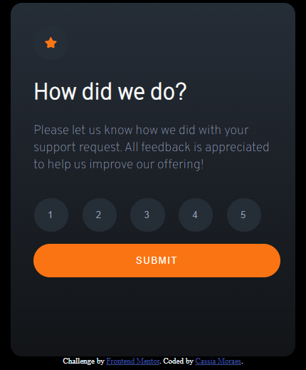

# Frontend Mentor - Interactive rating component solution

This is a solution to the [Interactive rating component challenge on Frontend Mentor](https://www.frontendmentor.io/challenges/interactive-rating-component-koxpeBUmI). Frontend Mentor challenges help you improve your coding skills by building realistic projects. 

## Table of contents

- [Overview](#overview)
  - [The challenge](#the-challenge)
  - [Screenshot](#screenshot)
  - [Links](#links)
- [My process](#my-process)
  - [Built with](#built-with)
  - [What I learned](#what-i-learned)
  - [Useful resources](#useful-resources)
- [Author](#author)
- [Acknowledgments](#acknowledgments)

## Overview

### The challenge

Users should be able to:

- View the optimal layout for the app depending on their device's screen size
- See hover states for all interactive elements on the page
- Select and submit a number rating
- See the "Thank you" card state after submitting a rating

### Screenshot



### Links

- Solution URL: [Interactive Rating]( https://cassiamoraes.github.io/Interactive-Rating/)
- Live Site URL: [GitHub](https://github.com/cassiamoraes)

## My process

### Built with

- Semantic HTML5 markup
- CSS custom properties
- Flexbox
- CSS Grid
- Mobile-first workflow
- [Styled Components](https://styled-components.com/) - For styles


### What I learned

In this session, I learned how to use javascript to hide and show divs. It also helped me to work better with the outline of elements in html.

To see how you can add code snippets, see below:

```html
<button class="btnSubmit" id="submit"> Submit </button>
```
```css
.btnSubmit{
      color: hsl(0, 0%, 100%);
      background-color: hsl(25, 97%, 53%);
      padding: 1rem;
      padding-left: 9rem;
      padding-right: 9rem;
      border-radius: 3rem;
      border: none;
      cursor: pointer;
      text-transform: uppercase;
      letter-spacing: 0.09rem;
    }

.btnSubmit:hover{
      color: hsl(25, 97%, 53%);
      background-color:  hsl(0, 0%, 100%);
    }

@media all and (max-width: 600px) {
  .btnSubmit{
      padding-right: 8rem;
      padding-left: 8rem; 
    }
}
```
```js
const btnSubmit = document.getElementById("submit")
btnSubmit.addEventListener('click', () => {
        
      if(conteudo.style.display == "block"){
          conteudo.style.display ="none";
      }else{
          conteudo2.style.display = "block";
      }
      conteudo.style.display ="none";
});
```


### Useful resources

- [Example resource 1](https://horadecodar.com.br/2020/08/26/como-esconder-ou-mostrar-uma-div-com-javascript/) - This helped me the hide div and to replace for other.


## Author

- LinkedIn - [Cassia Moraes](https://www.linkedin.com/in/cassia-moraes-797797139)
- Frontend Mentor - [@cassiality](https://www.frontendmentor.io/profile/cassiality)


